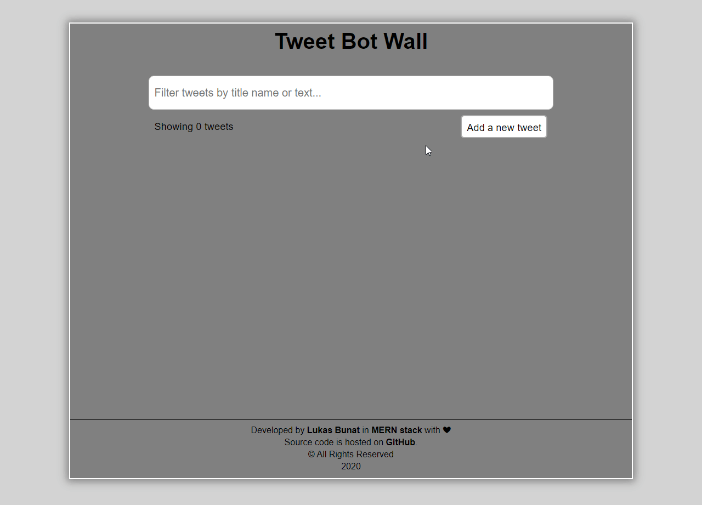

# Tweet bot wall
The tweet bot wall is an online tool that allows unregistered users to post their tweets on a public tweet wall. Tweets are pernametly stored in a DB (tweet wall).

## Description
- Public can tweet any tweet on the public tweet bot wall where will be all tweets stored.
- Tweets can be filtered or removed
- Each tweet can be liked or dislikes

## State
- ✅ Frontend
- ❌ Backend API

## Purpose
This MERN application has been developed to support practical part of my diploma thesis at University of Economics in Prague.

## Hosting
- Frontend part of the MERN app is hosted on [tweet.techis.fun](https://tweet.techis.fun)

## Demo

## Author
Lukas Bunat

## Lisence
Proprietary